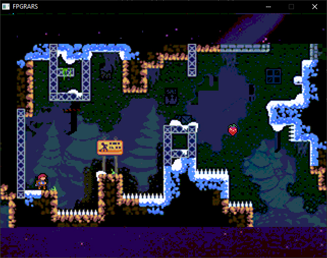
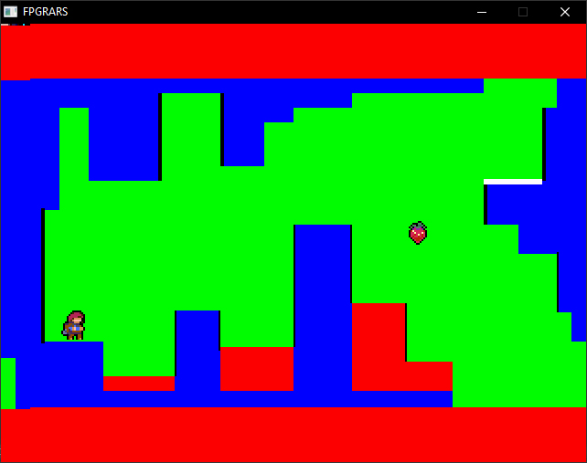

<h2>💬 Sobre o projeto</h2>

Implementação do jogo Celeste em Assembly RISC-V como projeto da disciplina de Organização e Arquitetura de Computadores da <a href="https://www.unb.br/" target="_blank">Universidade de Brasília</a>.

---

<h2>🛠 Como utilizar</h2>

### Execução

Para executar o jogo, basta executar o script `start.bat`.
Foi implementado para o simulador <a href="https://github.com/LeoRiether/FPGRARS" target="_blank">FPGRARS</a> v1.13.1.

## Teclas

| Tecla |     Função     |
|:-----:|:--------------:|
|   W   |      Pulo      |
|   A   |    Esquerda    |
|   D   |     Direita    |
|   I   |    Dash cima   |
|   J   |  Dash esquerda |
|   K   |   Dash baixo   |
|   L   |  Dash direita  |
|   M   | Mapa ou hitbox |
|   N   |  Próxima fase  |
|   B   |  Fase anterior |

---

<h2>⚙️ Especificações Técnicas</h2>

A principal mecânica é a colisão com as paredes, e para isso utilizamos duas versões de cada mapa: uma com o deisgn em si e outra com cores sólidas, indicando se cada pixel era algo com colisão (azul), parede (preto), morte (vermelho) ou livre (verde), como no exemplo abaixo:

---

<h2>💻 Autores</h2>

<table>
  <tr>
    <td align="center"><a href="https://github.com/tilnoene" target="_blank"> <b>Victor Manuel</b></a> </td>
    <td align="center"><a href="https://github.com/nathaliaop" target="_blank"> <b>Nathália Oliveira</b></a> </td>
    <td align="center"><a href="https://github.com/map3101" target="_blank"> <b>Marcelo Aiache</b></a> </td>
</table>